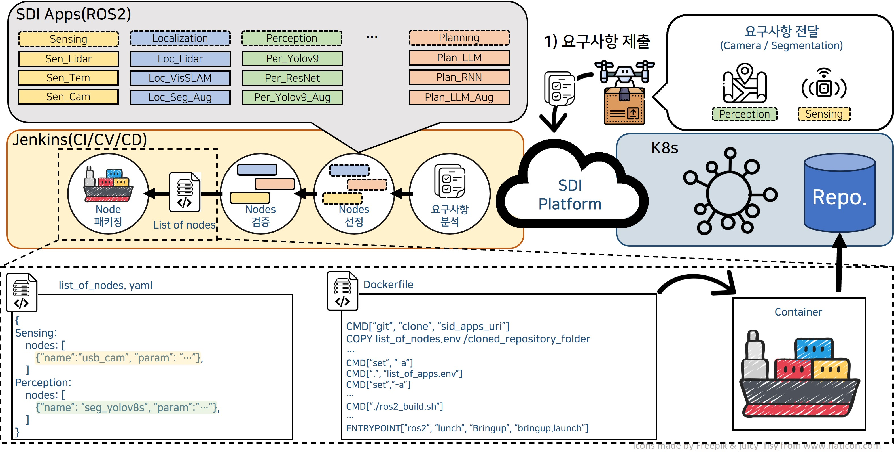

# [FOR DEMO] SDI CI/CD PIPELINE EXAMPLE 
 

SDI 1차년도 CI/CV/CD 파이프라인 데모를 위한 예제 저장소입니다.

### 데모 프로세스

요구사항 작성 및 github 저장소로 push --> requierments.txt

(Jenkins) requirements.txt --> ROS2 Nodes 선정 --> list_of_nodes.yaml

(Jenkins) list_of_nodes.yaml --> 선정된 노드들을 기반으로 Container 패키징 실시 --> Container Image 생성

(Jenkins) Container Image --> 내부 래포지토리로 저장

(K8s) SDx 디바이스로 컨테이너 배포

---
## TODO 
 * 프로젝트 README TOC 만들기
 * 틈틈히 소스코드 및 README 작성하기
 * ~~list_of_nodes 의 파일 형식 및 형태 정하기~~
 * ~~Container 경량화 문제 다루기~~
---
## Table of Contents

## Overview

## Node list
현재 구현되어 레포지토리에 존재하는 노드 정보

### Sensing
[Documents](./src/sensing/README.md)
* usb_cam 

### Perception
[Documents](./src/perception/README.md)
* seg_yolov8s

## Conventions
### Branch strategy
본 저장소는 Git-flow전략을 이용해 브랜치를 관리합니다.

`main(master)`: 오류없이 배포할 수 있도록 완성된 브랜치

`develop`: `main`브랜치 기반으로 다음 버전을 개발하는 브랜치

`release`: 다음 배포 버전을 준비하는 브랜치 (`develop` 브랜치에서 작업중인 기능이 완성/검증되면 `release`로 merge 됩니다.)

`feature`: 작은 모듈 및 기능을 개발하기 위한 브랜치

`hotfix`: 버그 수정을 위한 브랜치

관련해 읽어보면 도움이 되는 블로그입니다: [우린 Git-flow를 사용하고 있어요
](https://techblog.woowahan.com/2553/)

### ROS2 node naming
TBD

